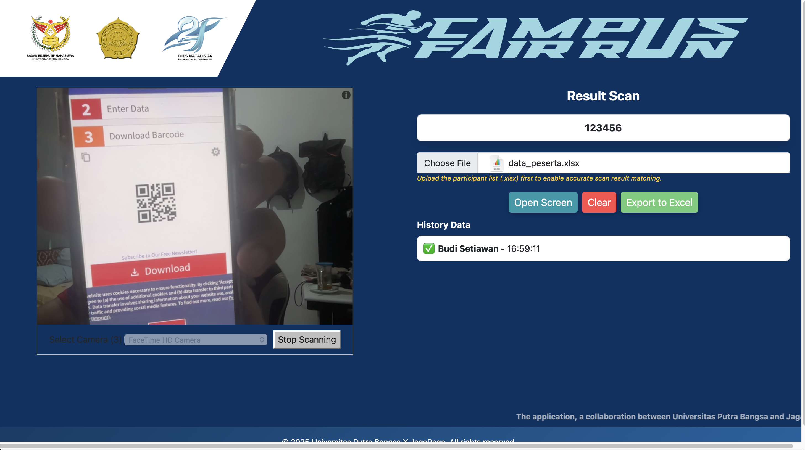

<!--
 Copyright 2025 ariefsetyonugroho
 
 Licensed under the Apache License, Version 2.0 (the "License");
 you may not use this file except in compliance with the License.
 You may obtain a copy of the License at
 
     https://www.apache.org/licenses/LICENSE-2.0
 
 Unless required by applicable law or agreed to in writing, software
 distributed under the License is distributed on an "AS IS" BASIS,
 WITHOUT WARRANTIES OR CONDITIONS OF ANY KIND, either express or implied.
 See the License for the specific language governing permissions and
 limitations under the License.
-->

# FUNRUN APP

## Description

This application is developed to facilitate the scanning of barcodes for participants in running events. When a participant's barcode is scanned, the app instantly processes and displays their information on a dedicated tab screen. The displayed details include the participant’s unique number, full name, and initials, allowing event organizers or staff to quickly verify and manage participant data in real-time. The tab-based interface ensures easy navigation and clear visibility of all scanned participants, enhancing efficiency during event check-ins or monitoring.


### Screenshot 


## How to Run
#### Clone project
```
git clone https://github.com/ASNProject/funRun.git
```

#### Run
Open ```http://localhost/funRun/index.html```
